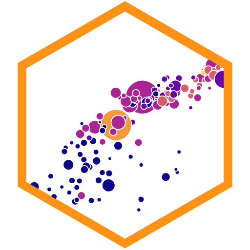
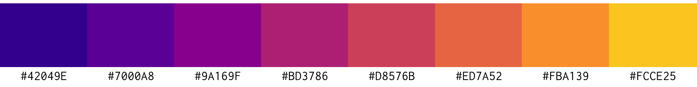

<!-- README.md is generated from README.qmd. Please edit that file -->

# Data Visualization with R <a href='https://datavizs24.classes.andrewheiss.com/'></a>

[PMAP 8551/4551 • Summer
2024](https://datavizs24.classes.andrewheiss.com/)  
[Andrew Heiss](https://www.andrewheiss.com/) • Andrew Young School of
Policy Studies • Georgia State University

------------------------------------------------------------------------

**[Quarto](https://quarto.org/) +
[{targets}](https://docs.ropensci.org/targets/) +
[{renv}](https://rstudio.github.io/renv/) = magic! 🪄**

------------------------------------------------------------------------

## How to build the site

1.  Install
    [RStudio](https://www.rstudio.com/products/rstudio/download/#download)
    version 2022.07.1 or later since it has a
    [Quarto](https://quarto.org/) installation embedded in it.
    Otherwise, download and install [Quarto](https://quarto.org/)
    separately.
2.  Open `datavizs24.Rproj` to open an [RStudio
    Project](https://r4ds.had.co.nz/workflow-projects.html).
3.  If it’s not installed already, R *should* try to install the [{renv}
    package](https://rstudio.github.io/renv/) when you open the RStudio
    Project for the first time. If you don’t see a message about package
    installation, install it yourself by running
    `install.packages("renv")` in the R console.
4.  Run `renv::restore()` in the R console to install all the required
    packages for this project.
5.  Run `targets::tar_make()` in the R console to build everything.
6.  🎉 All done! 🎉 The complete website will be in a folder named
    `_site/`.

## {targets} pipeline

I use the [{targets} package](https://docs.ropensci.org/targets/) to
build this site and all its supporting files. The complete pipeline is
defined in [`_targets.R`](_targets.R) and can be run in the R console
with:

``` r
targets::tar_make()
```

The pipeline does several major tasks:

- **Build Quarto website**: This project is a [Quarto
  website](https://quarto.org/docs/websites/), which compiles and
  stitches together all the `.qmd` files in this project based on the
  settings in [`_quarto.yml`](_quarto.yml). See the [Quarto website
  documentation](https://quarto.org/docs/websites/) for more details.

- **Upload resulting `_site/` folder to my remote server**: Quarto
  places the compiled website in a folder named `/_site/`. The pipeline
  uses `rsync` to upload this folder to my personal remote server. This
  target will only run if the `UPLOAD_WEBSITES` environment variable is
  set to `TRUE`, and it will only work if you have an SSH key set up on
  my personal server, which only I do.

The complete pipeline looks like this:

<small>(This uses [`mermaid.js`
syntax](https://mermaid-js.github.io/mermaid/) and should display as a
graph on GitHub. You can also view it by pasting the code into
<https://mermaid.live>.)</small>

``` mermaid
graph LR
  style Graph fill:#FFFFFF00,stroke:#000000;
  subgraph Graph
    direction LR
    x3f2ab5e74cba5dde(["get_data_fred"]):::queued --> xa1de4aa623defc27(["data_fred"]):::queued
    x3c2fdb322a18671d(["slide_html_02_slides"]):::queued --> xd854d4a9c89216ab(["slide_pdf_02_slides"]):::queued
    x5001cb60de5aa7c8(["slide_rmd_01_slides_files"]):::queued --> x39a82da8b6fae6fa["slide_rmd_01_slides"]:::queued
    x527abcc5677dae68(["build_data"]):::queued --> x5c7d48d1f6731584(["zip_proj_03_exercise"]):::queued
    x5d6dea1a226f7537(["copy_data"]):::queued --> x5c7d48d1f6731584(["zip_proj_03_exercise"]):::queued
    xe8f40a384a24d92b["proj_03_exercise"]:::queued --> x5c7d48d1f6731584(["zip_proj_03_exercise"]):::queued
    x5dee707e323d9bdb["slide_rmd_13_slides"]:::queued --> x7c3ed3bd4a1ecde3(["slide_html_13_slides"]):::queued
    x830adcacfab4076a(["deploy_script"]):::queued --> xd6774b1369562ec8(["deploy_site"]):::queued
    x5fee94802c729361(["site"]):::queued --> xd6774b1369562ec8(["deploy_site"]):::queued
    x527abcc5677dae68(["build_data"]):::queued --> xaca93fa5790dfb06(["zip_proj_12_exercise"]):::queued
    x5d6dea1a226f7537(["copy_data"]):::queued --> xaca93fa5790dfb06(["zip_proj_12_exercise"]):::queued
    xa8b6d753e4559bb5["proj_12_exercise"]:::queued --> xaca93fa5790dfb06(["zip_proj_12_exercise"]):::queued
    xc2499d888712748a(["slide_rmd_15_slides_files"]):::queued --> x9b58171ed1d6384b["slide_rmd_15_slides"]:::queued
    x8ccf1af7f721a931(["slide_html_08_slides"]):::queued --> xb53859a3a1196b64(["slide_pdf_08_slides"]):::queued
    x3dd54da269b2735f["slide_rmd_05_slides"]:::queued --> xb91d3491b4ad9fcb(["slide_html_05_slides"]):::queued
    xe4f696ed33dca3d5["slide_rmd_10_slides"]:::queued --> x7a2aa5493a1e174f(["slide_html_10_slides"]):::queued
    xb03f1698e2debc94(["slide_rmd_12_slides_files"]):::queued --> xc1418dbce57ce8dc["slide_rmd_12_slides"]:::queued
    x782368ccd11fc50b(["slide_rmd_04_slides_files"]):::queued --> xa5456a9999ae2296["slide_rmd_04_slides"]:::queued
    x527abcc5677dae68(["build_data"]):::queued --> x1fd9ab2cf9c514cb(["zip_proj_11_exercise"]):::queued
    x5d6dea1a226f7537(["copy_data"]):::queued --> x1fd9ab2cf9c514cb(["zip_proj_11_exercise"]):::queued
    x14ff0c0a3b581a77["proj_11_exercise"]:::queued --> x1fd9ab2cf9c514cb(["zip_proj_11_exercise"]):::queued
    x47e79497b1720795(["proj_03_exercise_files"]):::queued --> xe8f40a384a24d92b["proj_03_exercise"]:::queued
    x39a82da8b6fae6fa["slide_rmd_01_slides"]:::queued --> x32a35e8ee71c7064(["slide_html_01_slides"]):::queued
    x527abcc5677dae68(["build_data"]):::queued --> xfe9a87779456da8f(["zip_proj_09_exercise"]):::queued
    x5d6dea1a226f7537(["copy_data"]):::queued --> xfe9a87779456da8f(["zip_proj_09_exercise"]):::queued
    xf65f56f52b519b9b["proj_09_exercise"]:::queued --> xfe9a87779456da8f(["zip_proj_09_exercise"]):::queued
    x9277aa61cd48b837(["proj_10_exercise_files"]):::queued --> x4f1e7a64a3ad0e88["proj_10_exercise"]:::queued
    x376092e2d297750a(["slide_html_07_slides"]):::queued --> x0b8627ae1be8750b(["slide_pdf_07_slides"]):::queued
    xb88368986d4aa1bf(["copy_2016_election"]):::queued --> x5d6dea1a226f7537(["copy_data"]):::queued
    x6cd0dee42a24f288(["copy_essential_construction"]):::queued --> x5d6dea1a226f7537(["copy_data"]):::queued
    xf6926cf0b9c2f0f1(["copy_hot_dogs"]):::queued --> x5d6dea1a226f7537(["copy_data"]):::queued
    x9d77e3f40385c2cf(["copy_internet"]):::queued --> x5d6dea1a226f7537(["copy_data"]):::queued
    x52d1f77786fc35cf(["copy_lotr_fellowship"]):::queued --> x5d6dea1a226f7537(["copy_data"]):::queued
    xfd57e058b4891a64(["copy_lotr_rotk"]):::queued --> x5d6dea1a226f7537(["copy_data"]):::queued
    xe5925d8feb2e17dc(["copy_lotr_tt"]):::queued --> x5d6dea1a226f7537(["copy_data"]):::queued
    x655f7c7d213bbcce(["copy_natural_earth"]):::queued --> x5d6dea1a226f7537(["copy_data"]):::queued
    xa33faeb3fa230864(["copy_space_dogs"]):::queued --> x5d6dea1a226f7537(["copy_data"]):::queued
    xa020bc555d3d1acc(["copy_unemployment"]):::queued --> x5d6dea1a226f7537(["copy_data"]):::queued
    x527abcc5677dae68(["build_data"]):::queued --> xe7c15738acb47533(["zip_proj_04_exercise"]):::queued
    x5d6dea1a226f7537(["copy_data"]):::queued --> xe7c15738acb47533(["zip_proj_04_exercise"]):::queued
    xda528748853e3397["proj_04_exercise"]:::queued --> xe7c15738acb47533(["zip_proj_04_exercise"]):::queued
    xd1e486155305a9d8(["schedule_ical_data"]):::queued --> xe96618267648362b(["schedule_ical_file"]):::queued
    x3ece8da1469c00db(["slide_rmd_03_slides_files"]):::queued --> x86cd11787895f0ce["slide_rmd_03_slides"]:::queued
    x6a0b8564b0178835(["proj_02_example_files"]):::queued --> x62035c80c1931dd8["proj_02_example"]:::queued
    x0957c8c9732fa332(["slide_rmd_09_slides_files"]):::queued --> xdf5033dfd85e9b07["slide_rmd_09_slides"]:::queued
    xedc1399ac927335b(["proj_09_exercise_files"]):::queued --> xf65f56f52b519b9b["proj_09_exercise"]:::queued
    x7a2aa5493a1e174f(["slide_html_10_slides"]):::queued --> x3a60c74acfe26c44(["slide_pdf_10_slides"]):::queued
    xc1418dbce57ce8dc["slide_rmd_12_slides"]:::queued --> x0c6721b47332fe83(["slide_html_12_slides"]):::queued
    x4303322c71bdfc98(["proj_04_exercise_files"]):::queued --> xda528748853e3397["proj_04_exercise"]:::queued
    x879bfa4b7de0e7a9(["proj_example_final_files"]):::queued --> x27d40e204f5ff80a["proj_example_final"]:::queued
    xce2cc9c53c42aad7(["slide_rmd_06_slides_files"]):::queued --> x4e2decec9e1779c4["slide_rmd_06_slides"]:::queued
    xba08d43fc6642fc8(["proj_13_exercise_files"]):::queued --> xdd3ecb43ba724841["proj_13_exercise"]:::queued
    xecbe992e9bd44ed2(["get_data_wdi_comparisons"]):::queued --> xea52756aad62ec59(["data_wdi_comparisons"]):::queued
    x492aec160c1eec8d(["get_data_wdi_lifeexp"]):::queued --> x8dfde51a0d28871a(["data_wdi_lifeexp"]):::queued
    x32a35e8ee71c7064(["slide_html_01_slides"]):::queued --> xb5dcc63ac027309f(["slide_pdf_01_slides"]):::queued
    x527abcc5677dae68(["build_data"]):::queued --> x76c7e96f6128e2c3(["zip_proj_02_example"]):::queued
    x5d6dea1a226f7537(["copy_data"]):::queued --> x76c7e96f6128e2c3(["zip_proj_02_example"]):::queued
    x62035c80c1931dd8["proj_02_example"]:::queued --> x76c7e96f6128e2c3(["zip_proj_02_example"]):::queued
    x83c90c487d16eadc(["schedule_file"]):::queued --> x7f26ad8951796691(["schedule_page_data"]):::queued
    xf07d1b5b90f78e03(["little_women_tagged"]):::queued --> xde555170da93daa8(["data_little_women_tagged"]):::queued
    xdf5033dfd85e9b07["slide_rmd_09_slides"]:::queued --> x3cedd2b42c737227(["slide_html_09_slides"]):::queued
    x76c7e96f6128e2c3(["zip_proj_02_example"]):::queued --> x949bf61054cdbfad(["all_zipped_projects"]):::queued
    x4279c06185ef465b(["zip_proj_02_exercise"]):::queued --> x949bf61054cdbfad(["all_zipped_projects"]):::queued
    x5c7d48d1f6731584(["zip_proj_03_exercise"]):::queued --> x949bf61054cdbfad(["all_zipped_projects"]):::queued
    xe7c15738acb47533(["zip_proj_04_exercise"]):::queued --> x949bf61054cdbfad(["all_zipped_projects"]):::queued
    x6c3927f4b70f2cf6(["zip_proj_05_exercise"]):::queued --> x949bf61054cdbfad(["all_zipped_projects"]):::queued
    xb3bb93b68684645b(["zip_proj_06_exercise"]):::queued --> x949bf61054cdbfad(["all_zipped_projects"]):::queued
    xf262e3623e2f4b07(["zip_proj_07_exercise"]):::queued --> x949bf61054cdbfad(["all_zipped_projects"]):::queued
    x2d65253ed7b3bfde(["zip_proj_08_exercise"]):::queued --> x949bf61054cdbfad(["all_zipped_projects"]):::queued
    xfe9a87779456da8f(["zip_proj_09_exercise"]):::queued --> x949bf61054cdbfad(["all_zipped_projects"]):::queued
    x793622ee22711070(["zip_proj_10_exercise"]):::queued --> x949bf61054cdbfad(["all_zipped_projects"]):::queued
    x1fd9ab2cf9c514cb(["zip_proj_11_exercise"]):::queued --> x949bf61054cdbfad(["all_zipped_projects"]):::queued
    xaca93fa5790dfb06(["zip_proj_12_exercise"]):::queued --> x949bf61054cdbfad(["all_zipped_projects"]):::queued
    xf195a3335141ad31(["zip_proj_13_exercise"]):::queued --> x949bf61054cdbfad(["all_zipped_projects"]):::queued
    x61b72c217abdf73e(["zip_proj_14_exercise"]):::queued --> x949bf61054cdbfad(["all_zipped_projects"]):::queued
    x351320cc52161502(["zip_proj_example_final"]):::queued --> x949bf61054cdbfad(["all_zipped_projects"]):::queued
    xc8be1f356b80a5ac(["slide_html_15_slides"]):::queued --> x0803b8bcb4088cb9(["slide_pdf_15_slides"]):::queued
    x527abcc5677dae68(["build_data"]):::queued --> x793622ee22711070(["zip_proj_10_exercise"]):::queued
    x5d6dea1a226f7537(["copy_data"]):::queued --> x793622ee22711070(["zip_proj_10_exercise"]):::queued
    x4f1e7a64a3ad0e88["proj_10_exercise"]:::queued --> x793622ee22711070(["zip_proj_10_exercise"]):::queued
    x0c6721b47332fe83(["slide_html_12_slides"]):::queued --> x9f307c61c0684b51(["slide_pdf_12_slides"]):::queued
    x3633e9bc8b92fa35(["slide_rmd_11_slides_files"]):::queued --> x2fc1e0904d94beca["slide_rmd_11_slides"]:::queued
    x218c648ba493eca7(["slide_html_04_slides"]):::queued --> x8da37ce9706f9a14(["slide_pdf_04_slides"]):::queued
    x0dc1a8b47e76e805(["all_slides"]):::queued --> x5fee94802c729361(["site"]):::queued
    x949bf61054cdbfad(["all_zipped_projects"]):::queued --> x5fee94802c729361(["site"]):::queued
    xa1de4aa623defc27(["data_fred"]):::queued --> x5fee94802c729361(["site"]):::queued
    x67ad2d1638cd80fd(["data_geocoded"]):::queued --> x5fee94802c729361(["site"]):::queued
    xde555170da93daa8(["data_little_women_tagged"]):::queued --> x5fee94802c729361(["site"]):::queued
    xcb203eb03e2f2412(["data_wdi_annotations"]):::queued --> x5fee94802c729361(["site"]):::queued
    xea52756aad62ec59(["data_wdi_comparisons"]):::queued --> x5fee94802c729361(["site"]):::queued
    x8dfde51a0d28871a(["data_wdi_lifeexp"]):::queued --> x5fee94802c729361(["site"]):::queued
    x828115bd1ed512ad(["data_wdi_parliament"]):::queued --> x5fee94802c729361(["site"]):::queued
    x8b6ad04e87e06888(["gutenberg_books"]):::queued --> x5fee94802c729361(["site"]):::queued
    xf07d1b5b90f78e03(["little_women_tagged"]):::queued --> x5fee94802c729361(["site"]):::queued
    xe96618267648362b(["schedule_ical_file"]):::queued --> x5fee94802c729361(["site"]):::queued
    x7f26ad8951796691(["schedule_page_data"]):::queued --> x5fee94802c729361(["site"]):::queued
    x72c2061ddedee791(["proj_14_exercise_files"]):::queued --> x3b8755299d9c32b9["proj_14_exercise"]:::queued
    x9b58171ed1d6384b["slide_rmd_15_slides"]:::queued --> xc8be1f356b80a5ac(["slide_html_15_slides"]):::queued
    x527abcc5677dae68(["build_data"]):::queued --> x2d65253ed7b3bfde(["zip_proj_08_exercise"]):::queued
    x5d6dea1a226f7537(["copy_data"]):::queued --> x2d65253ed7b3bfde(["zip_proj_08_exercise"]):::queued
    xfc98124ac899c2ef["proj_08_exercise"]:::queued --> x2d65253ed7b3bfde(["zip_proj_08_exercise"]):::queued
    xa5456a9999ae2296["slide_rmd_04_slides"]:::queued --> x218c648ba493eca7(["slide_html_04_slides"]):::queued
    x5435378bb010702a(["get_data_wdi_parliament"]):::queued --> x828115bd1ed512ad(["data_wdi_parliament"]):::queued
    x527abcc5677dae68(["build_data"]):::queued --> xf262e3623e2f4b07(["zip_proj_07_exercise"]):::queued
    x5d6dea1a226f7537(["copy_data"]):::queued --> xf262e3623e2f4b07(["zip_proj_07_exercise"]):::queued
    x240b9eb72136885f["proj_07_exercise"]:::queued --> xf262e3623e2f4b07(["zip_proj_07_exercise"]):::queued
    xb9d12f12d1b272aa(["slide_rmd_14_slides_files"]):::queued --> xa82e4c2714985d36["slide_rmd_14_slides"]:::queued
    xba0eee0ae05b917e(["slide_html_03_slides"]):::queued --> x3f0ae6da980c2e5b(["slide_pdf_03_slides"]):::queued
    x527abcc5677dae68(["build_data"]):::queued --> x4279c06185ef465b(["zip_proj_02_exercise"]):::queued
    x5d6dea1a226f7537(["copy_data"]):::queued --> x4279c06185ef465b(["zip_proj_02_exercise"]):::queued
    x6071bd6ba10da050["proj_02_exercise"]:::queued --> x4279c06185ef465b(["zip_proj_02_exercise"]):::queued
    x527abcc5677dae68(["build_data"]):::queued --> xf195a3335141ad31(["zip_proj_13_exercise"]):::queued
    x5d6dea1a226f7537(["copy_data"]):::queued --> xf195a3335141ad31(["zip_proj_13_exercise"]):::queued
    xdd3ecb43ba724841["proj_13_exercise"]:::queued --> xf195a3335141ad31(["zip_proj_13_exercise"]):::queued
    x3cedd2b42c737227(["slide_html_09_slides"]):::queued --> xb7f4d8c8e461c6b9(["slide_pdf_09_slides"]):::queued
    x34d6c07a2097c551(["proj_08_exercise_files"]):::queued --> xfc98124ac899c2ef["proj_08_exercise"]:::queued
    x86cd11787895f0ce["slide_rmd_03_slides"]:::queued --> xba0eee0ae05b917e(["slide_html_03_slides"]):::queued
    x2e8be840059eefe5(["proj_07_exercise_files"]):::queued --> x240b9eb72136885f["proj_07_exercise"]:::queued
    x2fc1e0904d94beca["slide_rmd_11_slides"]:::queued --> xcc55386321c9e7e1(["slide_html_11_slides"]):::queued
    x11762edb9ae29fab(["slide_rmd_13_slides_files"]):::queued --> x5dee707e323d9bdb["slide_rmd_13_slides"]:::queued
    x368f698220791499(["slide_html_06_slides"]):::queued --> x37dd1ea5a70b6ffc(["slide_pdf_06_slides"]):::queued
    x69f3004fe573775a(["proj_02_exercise_files"]):::queued --> x6071bd6ba10da050["proj_02_exercise"]:::queued
    x78de70e29b2b5fc4(["slide_rmd_05_slides_files"]):::queued --> x3dd54da269b2735f["slide_rmd_05_slides"]:::queued
    xdf57381c885cd00f(["slide_rmd_02_slides_files"]):::queued --> x4d45c10c788cbb1e["slide_rmd_02_slides"]:::queued
    x4e2decec9e1779c4["slide_rmd_06_slides"]:::queued --> x368f698220791499(["slide_html_06_slides"]):::queued
    x8b6ad04e87e06888(["gutenberg_books"]):::queued --> xf07d1b5b90f78e03(["little_women_tagged"]):::queued
    x527abcc5677dae68(["build_data"]):::queued --> x61b72c217abdf73e(["zip_proj_14_exercise"]):::queued
    x5d6dea1a226f7537(["copy_data"]):::queued --> x61b72c217abdf73e(["zip_proj_14_exercise"]):::queued
    x3b8755299d9c32b9["proj_14_exercise"]:::queued --> x61b72c217abdf73e(["zip_proj_14_exercise"]):::queued
    xd38256ee6c716da4(["slide_rmd_08_slides_files"]):::queued --> x1995dd2d77d423df["slide_rmd_08_slides"]:::queued
    xb5dcc63ac027309f(["slide_pdf_01_slides"]):::queued --> x0dc1a8b47e76e805(["all_slides"]):::queued
    xd854d4a9c89216ab(["slide_pdf_02_slides"]):::queued --> x0dc1a8b47e76e805(["all_slides"]):::queued
    x3f0ae6da980c2e5b(["slide_pdf_03_slides"]):::queued --> x0dc1a8b47e76e805(["all_slides"]):::queued
    x8da37ce9706f9a14(["slide_pdf_04_slides"]):::queued --> x0dc1a8b47e76e805(["all_slides"]):::queued
    xd5b644ec3aff4c6c(["slide_pdf_05_slides"]):::queued --> x0dc1a8b47e76e805(["all_slides"]):::queued
    x37dd1ea5a70b6ffc(["slide_pdf_06_slides"]):::queued --> x0dc1a8b47e76e805(["all_slides"]):::queued
    x0b8627ae1be8750b(["slide_pdf_07_slides"]):::queued --> x0dc1a8b47e76e805(["all_slides"]):::queued
    xb53859a3a1196b64(["slide_pdf_08_slides"]):::queued --> x0dc1a8b47e76e805(["all_slides"]):::queued
    xb7f4d8c8e461c6b9(["slide_pdf_09_slides"]):::queued --> x0dc1a8b47e76e805(["all_slides"]):::queued
    x3a60c74acfe26c44(["slide_pdf_10_slides"]):::queued --> x0dc1a8b47e76e805(["all_slides"]):::queued
    x16a4cfdac0e86ef7(["slide_pdf_11_slides"]):::queued --> x0dc1a8b47e76e805(["all_slides"]):::queued
    x9f307c61c0684b51(["slide_pdf_12_slides"]):::queued --> x0dc1a8b47e76e805(["all_slides"]):::queued
    xa515c2432f42a64b(["slide_pdf_13_slides"]):::queued --> x0dc1a8b47e76e805(["all_slides"]):::queued
    x3c87d689cb981c63(["slide_pdf_14_slides"]):::queued --> x0dc1a8b47e76e805(["all_slides"]):::queued
    x0803b8bcb4088cb9(["slide_pdf_15_slides"]):::queued --> x0dc1a8b47e76e805(["all_slides"]):::queued
    xcc55386321c9e7e1(["slide_html_11_slides"]):::queued --> x16a4cfdac0e86ef7(["slide_pdf_11_slides"]):::queued
    x4d45c10c788cbb1e["slide_rmd_02_slides"]:::queued --> x3c2fdb322a18671d(["slide_html_02_slides"]):::queued
    x8588efa29319a17b(["proj_12_exercise_files"]):::queued --> xa8b6d753e4559bb5["proj_12_exercise"]:::queued
    xeb4b732280f64ef9(["slide_rmd_07_slides_files"]):::queued --> x670d8b11ea22361f["slide_rmd_07_slides"]:::queued
    x625986734a8fee6a(["get_data_geocoded"]):::queued --> x67ad2d1638cd80fd(["data_geocoded"]):::queued
    x527abcc5677dae68(["build_data"]):::queued --> xb3bb93b68684645b(["zip_proj_06_exercise"]):::queued
    x5d6dea1a226f7537(["copy_data"]):::queued --> xb3bb93b68684645b(["zip_proj_06_exercise"]):::queued
    x766bef475984472e["proj_06_exercise"]:::queued --> xb3bb93b68684645b(["zip_proj_06_exercise"]):::queued
    x743c186e92a4c3d1(["proj_11_exercise_files"]):::queued --> x14ff0c0a3b581a77["proj_11_exercise"]:::queued
    x83c90c487d16eadc(["schedule_file"]):::queued --> xd1e486155305a9d8(["schedule_ical_data"]):::queued
    x527abcc5677dae68(["build_data"]):::queued --> x6c3927f4b70f2cf6(["zip_proj_05_exercise"]):::queued
    x5d6dea1a226f7537(["copy_data"]):::queued --> x6c3927f4b70f2cf6(["zip_proj_05_exercise"]):::queued
    x2dc66291cf0bb4f1["proj_05_exercise"]:::queued --> x6c3927f4b70f2cf6(["zip_proj_05_exercise"]):::queued
    x1995dd2d77d423df["slide_rmd_08_slides"]:::queued --> x8ccf1af7f721a931(["slide_html_08_slides"]):::queued
    xf97356b842ce00f0(["slide_html_14_slides"]):::queued --> x3c87d689cb981c63(["slide_pdf_14_slides"]):::queued
    xade5e2c3ae084ff6(["get_data_wdi_annotations"]):::queued --> xcb203eb03e2f2412(["data_wdi_annotations"]):::queued
    x56b35e682aae9edd(["slide_rmd_10_slides_files"]):::queued --> xe4f696ed33dca3d5["slide_rmd_10_slides"]:::queued
    xa1de4aa623defc27(["data_fred"]):::queued --> x527abcc5677dae68(["build_data"]):::queued
    xae82ef75be61abf5(["data_gapminder"]):::queued --> x527abcc5677dae68(["build_data"]):::queued
    x67ad2d1638cd80fd(["data_geocoded"]):::queued --> x527abcc5677dae68(["build_data"]):::queued
    xde555170da93daa8(["data_little_women_tagged"]):::queued --> x527abcc5677dae68(["build_data"]):::queued
    xed5ceb9aca28295f(["data_mpg"]):::queued --> x527abcc5677dae68(["build_data"]):::queued
    xcb203eb03e2f2412(["data_wdi_annotations"]):::queued --> x527abcc5677dae68(["build_data"]):::queued
    xea52756aad62ec59(["data_wdi_comparisons"]):::queued --> x527abcc5677dae68(["build_data"]):::queued
    x8dfde51a0d28871a(["data_wdi_lifeexp"]):::queued --> x527abcc5677dae68(["build_data"]):::queued
    x828115bd1ed512ad(["data_wdi_parliament"]):::queued --> x527abcc5677dae68(["build_data"]):::queued
    x259a117364d2daf0(["proj_06_exercise_files"]):::queued --> x766bef475984472e["proj_06_exercise"]:::queued
    x527abcc5677dae68(["build_data"]):::queued --> x351320cc52161502(["zip_proj_example_final"]):::queued
    x5d6dea1a226f7537(["copy_data"]):::queued --> x351320cc52161502(["zip_proj_example_final"]):::queued
    x27d40e204f5ff80a["proj_example_final"]:::queued --> x351320cc52161502(["zip_proj_example_final"]):::queued
    x665f73a296b23800(["proj_05_exercise_files"]):::queued --> x2dc66291cf0bb4f1["proj_05_exercise"]:::queued
    x670d8b11ea22361f["slide_rmd_07_slides"]:::queued --> x376092e2d297750a(["slide_html_07_slides"]):::queued
    x7c3ed3bd4a1ecde3(["slide_html_13_slides"]):::queued --> xa515c2432f42a64b(["slide_pdf_13_slides"]):::queued
    xa82e4c2714985d36["slide_rmd_14_slides"]:::queued --> xf97356b842ce00f0(["slide_html_14_slides"]):::queued
    xb91d3491b4ad9fcb(["slide_html_05_slides"]):::queued --> xd5b644ec3aff4c6c(["slide_pdf_05_slides"]):::queued
    x660da1d01e230321(["workflow_graph"]):::dispatched --> x660da1d01e230321(["workflow_graph"]):::dispatched
  end
```

## Fonts and colors

The fonts used throughout the site are [Fira Sans
Condensed](https://fonts.google.com/specimen/Fira+Sans+Condensed) and
[Barlow](https://fonts.google.com/specimen/Barlow).

The colors for the site and hex logo come from the
[plasma](https://cran.r-project.org/web/packages/viridis/vignettes/intro-to-viridis.html#the-color-scales)
color scale from the viridis color maps:

``` r
viridisLite::viridis(8, option = "plasma", begin = 0.1, end = 0.9)
```



## Licenses

**Text and figures:** All prose and images are licensed under Creative
Commons ([CC-BY-NC
4.0](https://creativecommons.org/licenses/by-nc/4.0/))

**Code:** All code is licensed under the [MIT License](LICENSE.md).
